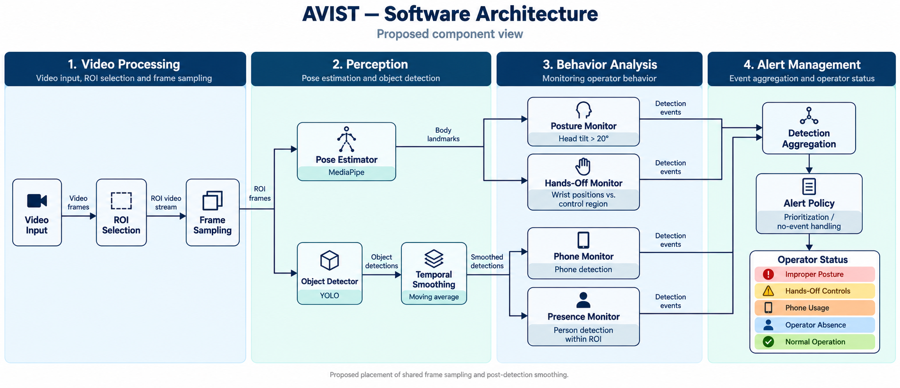

# Vision-Based Operator Monitoring for Safety in Mining Teleoperation

[](LICENSE)
[](https://doi.org/10.1007/978-3-032-32023-0_50)

This repository preserves the original operator-monitoring implementation used
for the article evaluation.

The complementary mobile-phone-detection study, including its released model
and training/reporting code, is available in
[mobile-phone-detection/](mobile-phone-detection/).

This directory preserves the final workflow used for the article evaluation, translated to English and made portable. It does not include the private videos, manually annotated CSV, generated frames, experiment results, or site-specific ROI.

All five scripts resolve generated artifacts relative to their own location.
They therefore write to [`outputs/`](outputs/) at the root of this papers
directory, regardless of the current working directory from which a script is
started.

## System architecture



*Figure 1 from the article: input preprocessing, parallel posture and operator-detection pipelines, state classification, and alert prioritization.*

## Workflow

1. `1_configure_roi.py` selects the operator region of interest (ROI) from a representative video.
2. `2_monitor_operator.py` runs the final classifier and exports sampled frames by predicted state.
3. `3_annotate_predictions.py` supports manual ground-truth annotation of exported frames.
4. `4_evaluate_predictions.py` produces the metrics table and normalized confusion matrix. During evaluation, `PHONE_DETECTED` is merged into `HANDS_OFF_CONTROLS`, matching the published evaluation procedure.
5. `5_validate_head_pose.py` generates the head-tilt validation graph used in the article.

The final historical implementation detects five internal states: `NORMAL`, `POSTURE_DEVIATION`, `HANDS_OFF_CONTROLS`, `OPERATOR_ABSENT`, and `PHONE_DETECTED`.

## Setup

Tested with Python 3.12 on Linux. Python 3.10 to 3.12 is recommended. `tkinter` must be available because steps 1 and 3 use a desktop interface. On Debian/Ubuntu, install it with `sudo apt install python3-tk` if it is missing.

```bash
python -m venv .venv
source .venv/bin/activate
python -m pip install --upgrade pip
# Portable CPU installation. For NVIDIA GPU support, install the matching PyTorch build first.
python -m pip install torch==2.5.1 torchvision==0.20.1 --index-url https://download.pytorch.org/whl/cpu
python -m pip install -r requirements.txt
```

## Run

Create an ROI configuration from a representative video. If `outputs/roi_config.json` already contains a valid video path, the script reuses it and displays the saved ROI. Press `V` in the ROI window to select a different video:

```bash
python 1_configure_roi.py
```

The dialog writes `outputs/roi_config.json`. Create a `videos/` directory in this directory and add the videos you are authorized to process. Supported formats are MP4, AVI, MOV, and MKV. If that directory has no supported videos, the script opens a folder picker. Then run:

```bash
python 2_monitor_operator.py
```

The script exports sampled frames to `outputs/frames_by_state/`. `yolo11x.pt` is downloaded to `outputs/` if it is not already available locally.

## Evaluate manually annotated data

Run the annotation interface from this directory:

```bash
python 3_annotate_predictions.py
```

It creates `outputs/manual_annotations.csv` with `file`, `prediction`, and `ground_truth` columns. Assign labels with keys `1` to `5`; press `0` to skip a frame. To generate the article-style metrics and normalized confusion matrix:

```bash
python 4_evaluate_predictions.py
```

The output files are `outputs/classification_report.txt`, `outputs/table_1_classification_metrics.png`, and `outputs/confusion_matrix.png`. All generated artifacts are kept in `outputs/` and ignored by Git.

## Head-pose validation

The fifth step is based on the historical `analise_comportamento2.py` script and generates the final 60-frame graph with the 20-degree threshold shown in the article:

```bash
python 5_validate_head_pose.py
```

It updates `outputs/head_pose_validation/head_tilt_last_60_frames.png` and `outputs/head_pose_validation/current_roi.png` during execution, and writes `outputs/head_pose_validation/head_tilt_measurements.csv` when it stops. Press `Q`, `Esc`, or close the preview window to stop safely. Add `--save-video` to also export an annotated video.

## Reproducibility note

These scripts retain the final implementation that produced the annotated evaluation workflow. The paper describes some parameters differently (for example, a 20° posture threshold and YOLO-based absence detection); this repository does not claim that those details were implemented by the historical final script.

## Citation

If you use this code in your research, please cite the complementary
mobile-phone-detection paper:

```bibtex
@InProceedings{10.1007/978-3-032-32023-0_50,
author="Lopes, Eduardo Lamy
and Pellenz, Marcelo Eduardo
and Teixeira, Marco Antonio Sim{\~o}es",
editor="Rocha, Alvaro
and Adeli, H.
and Moreira, Fernando",
title="Mobile Phone Detection for Mining Teleoperation Safety",
booktitle="Recent Trends and Challenges in Information Systems and Technologies",
year="2027",
publisher="Springer Nature Switzerland",
address="Cham",
pages="615--625",
abstract="Although remote operation improves operator safety by removing personnel from hazardous mining environments, it introduces critical challenges in maintaining situational awareness across multiple distraction vectors. This work presents an integrated monitoring framework that combines four safety validations: posture analysis, hand position tracking, operator presence detection, and mobile phone detection. Initial deployment revealed a critical performance gap: while three behavioral validations operated effectively, standard object detectors failed dramatically for phone detection, achieving only 0.03 F1-score. This deficit motivated a systematic investigation that led to a comprehensive comparative analysis of all five YOLO11 variants (n, s, m, l, x) retrained on 2,879 domain-specific images using 5-fold cross-validation to ensure rigorous validation. Our key finding is that all variants achieved statistically equivalent performance (mAP@0.5{\thinspace}>{\thinspace}95{\%}, p{\thinspace}={\thinspace}0.958), establishing YOLO11-Nano as the optimal choice due to its 415 FPS throughput and minimal 4.2 MB footprint. The integrated four-component framework achieves an overall accuracy of 87{\%} while implementing a risk-based alert hierarchy that prioritizes mobile phone use (the most cognitively engaging distraction) above posture deviation, hands-off controls, and operator absence. This work offers mining operations a scalable, efficiency-optimized solution for comprehensive distraction monitoring.",
isbn="978-3-032-32023-0"
}
```

## License

This repository is released under the **MIT License**.<br>
You are free to use, modify, and distribute this code for research and educational purposes, provided proper attribution is given.<br>
See the [LICENSE](LICENSE) file for more details.
